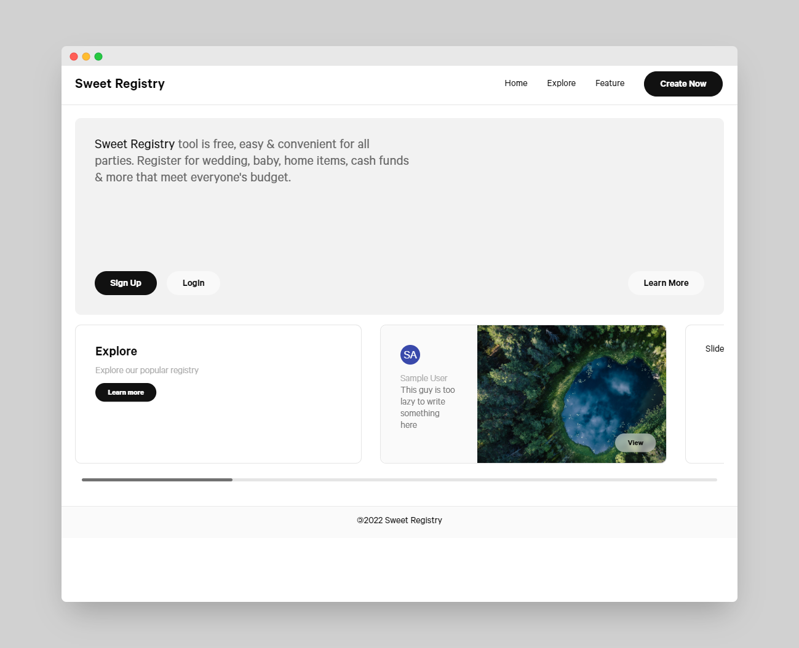

# Sweet Registry
Note: This is a mock registry app for COIS 3420

## Link
[https://sweetregistry.xyz](https://sweetregistry.xyz)

## Screenshot

## References
[https://github.com/sindresorhus/css-in-readme-like-wat](https://github.com/sindresorhus/css-in-readme-like-wat)

[https://plnkr.co/edit/znqKCyseooyUxC7lxmst?p=preview&preview](https://plnkr.co/edit/znqKCyseooyUxC7lxmst?p=preview&preview)

[https://codepen.io/shshaw/pen/YpERQQ](https://codepen.io/shshaw/pen/YpERQQ)

[https://read.cv/explore](https://read.cv/explore)

[https://www.30secondsofcode.org/css/s/hover-underline-animation](https://www.30secondsofcode.org/css/s/hover-underline-animation)

[https://vercel.com/dashboard](https://vercel.com/dashboard)

[https://developer.mozilla.org/en-US/docs/Web/JavaScript/Reference/Global_Objects/Array/some](https://developer.mozilla.org/en-US/docs/Web/JavaScript/Reference/Global_Objects/Array/some)

[https://css-tricks.com/emoji-as-a-favicon/](https://css-tricks.com/emoji-as-a-favicon/)
